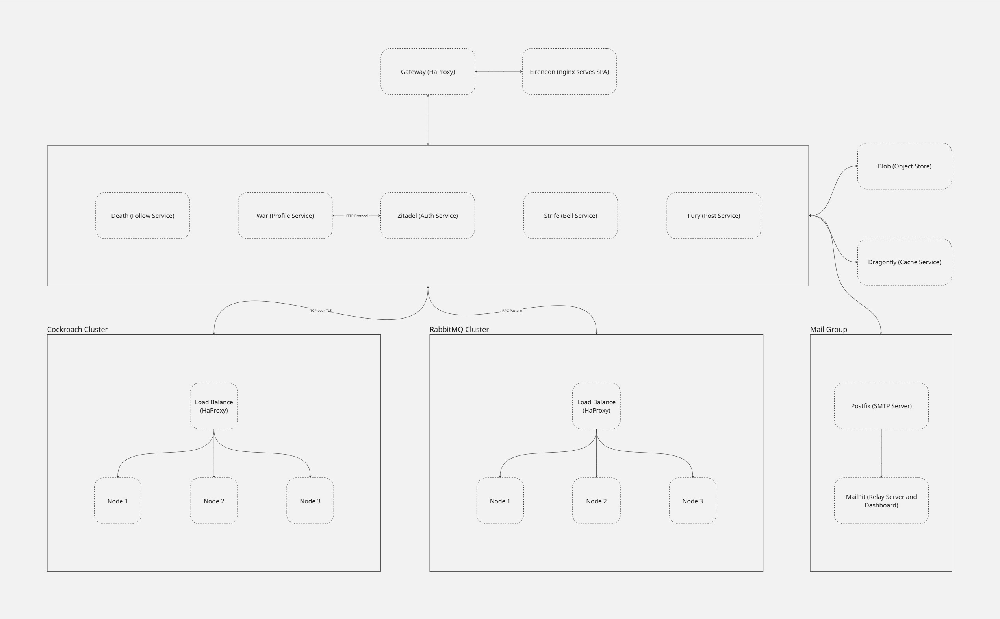

# System Overview

## Purpose

This system is a distributed social media platform composed of independently deployed microservices. Each service is responsible for a specific business capability, enabling scalability, maintainability, and clear separation of concerns. The frontend communicates with the backend services via REST APIs, and services interact asynchronously using RabbitMQ where needed.

---

## Architecture Diagram

---

## Key Concepts

- **Microservices Architecture**: Each core domain (profiles, posts, connections, notifications) is handled by an isolated service.
- **Separation of Concerns**: Services do not share databases or internal logic, allowing for independent scaling and development.
- **Polyglot Infrastructure**: Services use specialized components like CockroachDB, Dragonfly, and MinIO for data handling and performance.

---

## Component Summary

| Component   | Role                                         |
|------------|----------------------------------------------|
| **Death**   | Manages user connections (followers/following) |
| **War**     | Handles user profile creation and updates    |
| **Fury**    | Manages content publishing and likes         |
| **Strife**  | Sends and manages user notifications         |
| **Eireneon**| Provides the frontend experience using Next.js |
| **Zitadel** | Handles user authentication and identity     |
| **CockroachDB** | Distributed relational database backend  |
| **Dragonfly** | High-performance caching system            |
| **RabbitMQ** | Asynchronous messaging between services     |
| **MinIO**   | Object storage for media (e.g., images)      |
| **Postfix + Mailpit** | Email delivery and testing        |
| **HAProxy** | External gateway to route traffic to services |

---

## Communication Flows

- **Frontend to Backend**: All user interactions in Eireneon are routed via HAProxy to the appropriate backend services over REST.
- **Service-to-Service**:
  - Synchronous calls use REST.
  - Asynchronous tasks, especially notifications and background events, use RabbitMQ.
- **Storage and Caching**:
  - Services persist data in CockroachDB.
  - Posts and user interactions are cached in Dragonfly for performance.
  - Media files are uploaded to and served from MinIO.

---

## Deployment Characteristics

- Services are independently deployable.
- The architecture supports high availability and horizontal scaling.
- Most services are stateless, with state externalized via CockroachDB and Dragonfly.
- Dragonfly replaces Redis for more efficient memory handling and performance.

