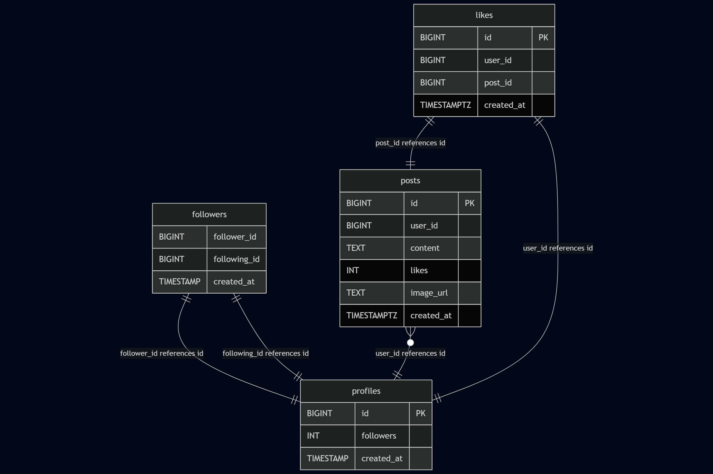

# Data Model Overview

This document describes the core data entities and their relationships within the distributed social media system. The platform is composed of multiple microservices, each owning its own database and data schema. The services follow the principle of bounded context, where each service is responsible for a specific domain and manages its own persistent data.

---

## Databases

Each service uses its own logical database, hosted in a CockroachDB cluster for high availability and distributed consistency.

| Service | Database | Description |
|--------|----------|-------------|
| **Death** | `death` | Stores data related to user connections (followers and following). |
| **War**   | `war`   | Stores user profile metadata such as follower count and creation time. |
| **Fury**  | `fury`  | Stores user-generated posts and likes. Also handles media references. |

---

## Entities and Relationships

### 🔁 `followers` (Service: Death)

Represents a social connection where one user follows another. Each pair is unique and stored with a timestamp.

- **Columns**:
  - `follower_id`: ID of the user who follows.
  - `following_id`: ID of the user being followed.
  - `created_at`: Timestamp of when the relationship was created.

- **Constraints**:
  - Unique on (`follower_id`, `following_id`) to avoid duplicates.

---

### 👤 `profiles` (Service: War)

Represents a user profile. This service does not create users but stores profile-specific metadata.

- **Columns**:
  - `id`: Unique identifier (matches the user ID from the auth service).
  - `followers`: Count of followers.
  - `created_at`: Timestamp of profile creation.

---

### 📝 `posts` (Service: Fury)

Represents user-created posts. May include optional media (images).

- **Columns**:
  - `id`: Unique identifier.
  - `user_id`: Author of the post.
  - `content`: Text content of the post.
  - `likes`: Like counter.
  - `image_url`: URL to image in object storage (MinIO).
  - `created_at`: Timestamp of creation.

---

### ❤️ `likes` (Service: Fury)

Tracks which users have liked which posts. Each like is unique per user-post pair.

- **Columns**:
  - `id`: Unique identifier.
  - `user_id`: User who liked the post.
  - `post_id`: Post that was liked.
  - `created_at`: Timestamp of like.

- **Constraints**:
  - Unique on (`user_id`, `post_id`) to avoid double-liking.

---

## Data Relationships

The following relationships are observed across services:

- A `follower_id` and `following_id` in the `followers` table both reference a `profile` in `war.profiles`.
- Each `post` in `fury.posts` is authored by a user identified by `user_id`, which references `war.profiles.id`.
- Each `like` in `fury.likes` references both:
  - A `post` (`fury.posts.id`)
  - A `user` (`war.profiles.id`)

All references are **logical only** since the databases are service-owned and cross-service joins are avoided. Services communicate through APIs or messaging to resolve IDs when needed.

---

## Design Considerations

- **Data Ownership**: Each service is the sole owner of its data schema and enforces domain-specific constraints.
- **Distributed Consistency**: Referential integrity across services is ensured at the application level rather than through foreign keys.
- **Scalability**: The use of separate databases and services allows each domain to scale independently.
- **Normalization**: Data is normalized within services. Denormalization is handled via caching (Dragonfly) or materialized views when needed.

---

## Diagram

A visual entity-relationship diagram is available to illustrate the schema and relationships.

