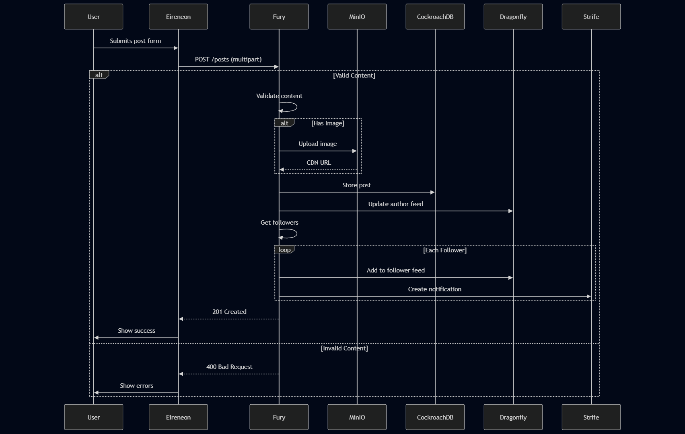

## Use Case: Create New Post

**Description**:  
Allows authenticated users to publish content consisting of text and an optional image, distributing it to their followers' feeds.

**Actor**:  
Authenticated user (with valid session cookie)

### Preconditions:
- Valid session cookie present
- User account in good standing
- Content meets platform guidelines
- Image under size limit (10MB)

### Main Flow:

1. **Content Submission**
   ```http
   POST /api/posts
   Headers:
     Cookie: sessionId=[encrypted]
     Content-Type: multipart/form-data
   Body:
     text: String (1-500 chars)
     image: File (optional, <10MB)
   ```

2. **Content Validation (Fury Service)**
   - Checks:
     - Text length and prohibited content
     - Image format (jpg/png/webp)
     - Image dimensions (max 4000x4000px)
     - User posting frequency (<5 posts/min)

3. **Media Processing**
   - For images:
     ```python
     def process_image(file):
         resize_to(1200x1200)
         compress(quality=85)
         store_in_minio(bucket='posts')
         generate_thumbnail(400x400)
     ```
   - Returns a blob in base64

4. **Post Storage**
   - CockroachDB insertion:
     ```sql
     INSERT INTO posts 
     (id, user_id, text, image_url, created_at)
     VALUES 
     (uuid_v7(), :user_id, :text, :image_url, NOW())
     ```

5. **Feed Distribution**
   - Dragonfly pipeline execution:
     ```Dragonfly
     # Add to author's feed
     ZADD feed:{user_id} {timestamp} {post_id}
     
     # Push to followers' feeds
     FOR follower IN followers:
         ZADD feed:{follower} {timestamp} {post_id}
         ZREMRANGEBYRANK feed:{follower} 0 -1000
     ```

6. **Notification (Strife Service)**
   - Fan-out to followers via:
     ```python
     # For each follower
     notification = {
         Type       = "new_post",
         UserID     = followerID,
         ActorID    = authorID,
         PostID     = postID,
         CreatedAt  = time.Now()
     }
     # push notification
     ```

### Alternative Flows:

**A1: Validation Failure**
- Returns `400 Bad Request` with:
  ```json
  {
    "error": "invalid_content",
    "details": ["text_too_long", "image_invalid"]
  }
  ```

**A2: Rate Limit Hit**
- Returns `429 Too Many Requests`
- Retry-After header: 60 seconds

**A3: Storage Failure**
- Retry 3 times
- Fallback to disk queue
- System alert triggered

### Post-Conditions:
- Post visible in author's profile immediately
- Appears in followers' feeds within 5s
- Image available at CDN within 15s
- Notifications delivered within 30s

### Security Controls:
- Content moderation scan
- EXIF data stripping
- CSRF protection
- Rate limiting
- Signed CDN URLs

### Performance Optimizations:
- Batch Dragonfly operations
- Async notification queue
- Image processing workers
- Feed write-back caching

### **Data Flow Diagram**  


