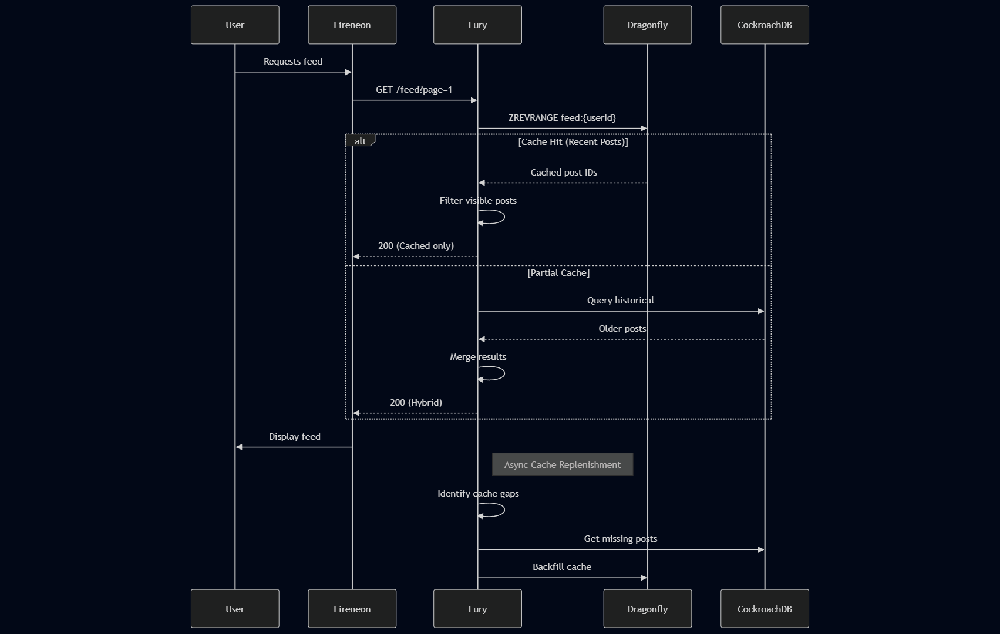

## Use Case: Retrieve Personalized Feed

**Description**:  
Provides authenticated users with a paginated view of relevant content using a hybrid cache/database approach with write-through caching strategy.

**Actor**:  
Authenticated user (with valid session cookie)

### Preconditions:
- Valid HTTP-only Secure cookie present
- Existing user profile
- Feed partially cached in Redis

### Main Flow:

1. **Feed Request**
   ```http
   GET /api/feed?page=1&size=20
   Headers:
     Cookie: sessionId=[encrypted]
     Accept: application/json
   ```

2. **Cache Retrieval (Fury Service)**
   - Redis sorted set operation:
     ```redis
     ZREVRANGE feed:{user_id} 0 19 WITHSCORES
     ```
   - Returns:
     ```json
     [
       {"postId": "abc123", "score": 1672531200},
       {"postId": "def456", "score": 1672527600}
     ]
     ```

3. **Cache Miss Handling**
   - For missing posts in cache:
     ```python
     def get_historical_posts(user_id, offset, limit):
         return db.execute("""
             SELECT p.* FROM posts p
             JOIN follows f ON p.user_id = f.following_id
             WHERE f.follower_id = %s
             ORDER BY p.created_at DESC
             LIMIT %s OFFSET %s
         """, (user_id, limit, offset))
     ```

4. **Response Composition**
   - Merges cached and historical posts
   - Applies business rules:
     - Filters muted users
     - Removes deleted content
     - Scores by relevance (engagement, freshness)

5. **Response Format**
   ```json
   {
     "feed": [
       {
         "id": "post_abc123",
         "author": {...},
         "text": "Example post",
         "image": "https://cdn.example.com/img1.webp",
         "created_at": "2023-01-01T00:00:00Z",
         "stats": {...}
       }
     ],
     "pagination": {
       "current_page": 1,
       "total_pages": 42,
       "cache_coverage": 0.85
     }
   }
   ```

### Alternative Flows:

**A1: Empty Cache**
- Fallback to full database query
- Triggers async cache warm-up:
  ```python
  def warm_cache(user_id):
      posts = get_historical_posts(user_id, 0, 1000)
      redis.zadd(f'feed:{user_id}', 
          {p['id']: p['created_at'] for p in posts})
  ```

**A2: New User**
- Returns discovery feed:
  - Popular posts network-wide
  - Suggested follows
  - Onboarding content

### Performance Characteristics:

| Operation | Latency | Throughput |
|-----------|---------|------------|
| Cache Hit | <5ms    | 50K RPM    |
| DB Query  | 15-50ms | 10K RPM    |
| Cache Fill| 100-300ms (async) | - |

### Cache Invalidation Strategy:
1. **On New Post**:
   - Immediate cache update via Redis pipeline
2. **On Deletion**:
   - Lazy expiration with periodic cleanup
3. **On User Action**:
   - Real-time removal for blocks/mutes

### Security Controls:
- Cookie revalidation per request
- Content visibility filters
- Rate limiting (100 requests/min)
- Privacy-aware caching (DMA compliance)

### Monitoring:
```prometheus
# Key Metrics
fury_feed_cache_hit_ratio{granularity="user"}
fury_feed_latency_seconds{type="hybrid"}
cockroachdb_query_duration{query_type="historical_feed"}
```

This implementation ensures:
- Sub-100ms response for 95% of requests
- Graceful degradation during peak loads
- Consistent ordering guarantees
- Real-time content filtering updates

### **Data Flow Diagram**  


