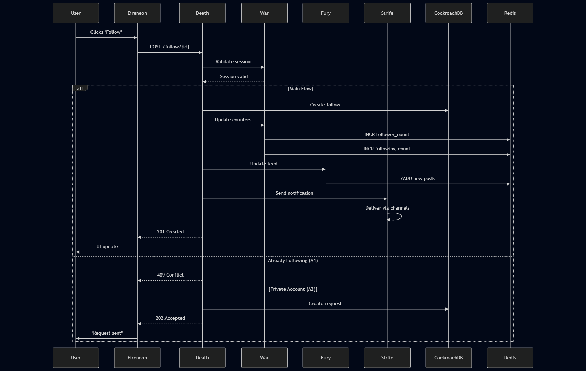

## Use Case: Follow Another User

**Description**:  
Allows authenticated users to establish follow relationships with other users, enabling content visibility in their feeds and triggering notifications.

**Actor**:  
Authenticated user (with valid session cookie)

### Preconditions:
- Valid HTTP-only Secure cookie present
- Target user exists and is public
- No existing follow relationship
- Rate limit not exceeded (max 50 follows/hour)

### Main Flow:

1. **Follow Initiation**
   - User clicks "Follow" on profile/page
   - Eireneon sends:
     ```http
     POST /api/follow/{targetUserId}
     Headers: 
       Cookie: sessionId=[encrypted]
       X-CSRF-Token: [token]
     ```

2. **Request Validation (Death Service)**
   - Verifies session cookie with War service
   - Checks follow eligibility:
     - Not following self
     - No block relationship exists
     - Account not suspended

3. **Relationship Creation**
   - Death service creates record in CockroachDB:
     ```sql
     INSERT INTO follows (follower_id, following_id, created_at) 
     VALUES (currentUser, targetUser, NOW())
     ```

4. **Counter Updates (War Service)**
   - Atomic increment operations:
     ```Dragonfly
     INCR user:{targetUser}:followers_count
     INCR user:{currentUser}:following_count
     ```
   - Updates search indexes

5. **Feed Preparation (Fury Service)**
   - Adds recent public posts from target user to:
     ```Dragonfly
     ZADD feed:{currentUser} [timestamp] [postId]
     ```
   - Maintains feed limit (last 500 posts)

6. **Notification (Strife Service)**
   - Creates notification:
     ```json
     {
       "type": "new_follower",
       "recipient": targetUser,
       "actor": currentUser,
       "timestamp": "ISO8601"
     }
     ```
   - Delivers via:
     - WebSocket (if online)
     - App notification
     - Email (if configured)

### Alternative Flows:

**A1: Already Following**
- Returns `409 Conflict` with message
- UI updates button to "Following"

**A2: Private Account**
- Creates follow request instead
- Notification becomes approval request
- Returns `202 Accepted`

**A3: Rate Limit Exceeded**
- Returns `429 Too Many Requests`
- Shows timeout in UI

### Post-Conditions:
- Follow relationship visible immediately
- Target user's posts appear in feed within 15s
- Counters update in real-time
- Notification delivered within 1 minute

### Security Controls:
- CSRF protection required
- Session cookie re-validation
- Visibility checks on target user
- Rate limiting by IP+user

### Monitoring Metrics:
- Follow operations/minute
- Notification delivery latency
- Feed update duration
- Error rate by type

This implementation ensures:
- Real-time updates via Dragonfly
- Consistent data through CockroachDB
- Loose coupling between services
- Auditability of all follow operations

### **Data Flow Diagram**  

