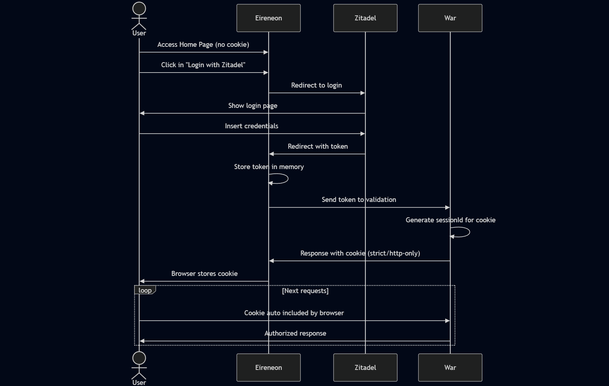

## Use Case: User Authentication via Zitadel (OIDC Provider)

**Description**:  
Allows unauthenticated users to securely log in using Zitadel as an OpenID Connect (OIDC) provider, establishing a protected session with proper HTTP security headers.

**Actor**:  
Unauthenticated user (no existing session cookie)

### Main Flow:

1. **Application Access**
   - User navigates to Eireneon's homepage
   - System detects no active session

2. **Authentication Initiation**
   - User clicks "Log In" button
   - Eireneon constructs OIDC authorization request:
     - `response_type=code`
     - `scope=openid profile email`
     - PKCE code challenge
   - Redirects to Zitadel's authorization endpoint

3. **Zitadel Authentication**
   - User authenticates via Zitadel's interface (password, social login, etc.)
   - Zitadel validates credentials
   - Zitadel issues authorization code

4. **Token Exchange**
   - Eireneon backend exchanges code for tokens:
     - ID Token (JWT)
     - Access Token
     - Refresh Token
   - Tokens stored in memory cache (short-lived)

5. **Session Establishment**
   - Eireneon forwards ID Token to War service
   - War service:
     - Validates JWT signature
     - Verifies claims (iss, aud, exp)
     - Creates session record
   - Returns secure cookie:
     - `SessionId=[encrypted]`
     - Attributes: `HttpOnly; Secure; SameSite=Strict; Path=/`
     - Max-Age: 5 hours

6. **Authenticated State**
   - Browser automatically includes cookie in subsequent requests
   - Eireneon services validate session via:
     - Cookie → War service session validation
     - JWT in Authorization header only for swap from cookie

### Security Considerations:
- **PKCE** for authorization code flow
- **Refresh token** rotation
- **CSRF** protection via SameSite cookies
- **XSS** protection via HttpOnly cookies

### Error Handling:
- **Invalid tokens**: Immediate 401 with redirect to login
- **Expired sessions**: Silent refresh via refresh token
- **CSRF attempts**: Cookie SameSite policy blocks
- **Multiple devices**: War service maintains session registry

### Post-Authentication State:
- User profile available via War service
- Session visible in "Active sessions" dashboard
- Audit log entry in Zitadel
- Session refresh mechanism established

This flow implements OAuth 2.0 security best practices while providing seamless UX. The separation between Zitadel (identity), War (session management), and Eireneon (application) follows zero-trust architecture principles.

### **Data Flow Diagram**  

