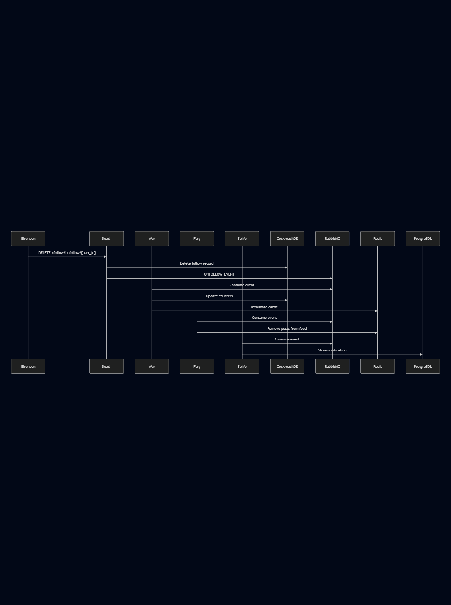

## Use Case: Unfollow User  

**Description**:  
Allows authenticated users to stop following another user, removing their posts from their feed and ending social connections.  

**Actor**:  
Authenticated user (with valid session cookie)  

### **Preconditions**:  
- User is logged in (valid JWT session)  
- User currently follows the target user  
- Target user exists and is active  

---

### **Main Flow**:  

1. **User Initiates Unfollow Action**  
   - User clicks "Unfollow" button on another user’s profile (Eireneon frontend)  
   - Frontend sends `DELETE /api/follow/{user_id}` to **Death** service  

2. **Death Service Processes Request**  
   - Validates JWT token (user authentication)  
   - Checks if follow relationship exists  
   - Deletes follow record from **CockroachDB**  
   - Publishes `UNFOLLOW_EVENT` to **RabbitMQ**  

3. **War Service Updates Counters**  
   - Consumes `UNFOLLOW_EVENT` from RabbitMQ  
   - Decrements `follower_count` for the unfollowed user  
   - Decrements `following_count` for the current user  
   - Updates **Dragonfly** cache for profile stats  

4. **Fury Service Updates Feeds**  
   - Receives event via **RabbitMQ**  
   - Removes unfollowed user’s posts from current user’s **Dragonfly**-cached feed  
   - Updates feed ranking in **CockroachDB**  

5. **Strife Service Notifies Unfollowed User (Optional)**  
   - Sends in-app notification:  
     *"@{username} stopped following you"*  
   - Stores notification in **PostgreSQL** (if enabled in settings)  

6. **Success Response**  
   - **Death** returns `HTTP 204 No Content`  
   - Frontend updates UI (removes "Following" status)  

---

### **Alternative Flows**  

**A1: User Not Following Target**  
- **Death** checks relationship → returns `HTTP 409 Conflict` ("Not following this user")  
- Frontend disables unfollow button  

**A2: Target User Doesn’t Exist**  
- **Death** validates user ID → returns `HTTP 404 Not Found`  
- Frontend shows error toast  

**A3: Rate-Limited Request**  
- **HAProxy** blocks repeated calls (>5/min) → `HTTP 429 Too Many Requests`  

---

### **Post-Conditions**  
✅ Follow relationship removed from **CockroachDB**  
✅ Follower/following counts updated in **War**  
✅ Feed sanitized in **Fury** (next refresh)  
❌ Optional notification sent via **Strife**  

### **Error Handling**  
- Database failures trigger retries via **RabbitMQ DLQ**  
- Cache inconsistencies resolved via **War**’s daily reconciliation job  

### **Security & Compliance**  
- JWT required for all endpoints  
- Users can only unfollow their own connections  
- Audit log entry created in **Death**’s database

### **Data Flow Diagram**  

