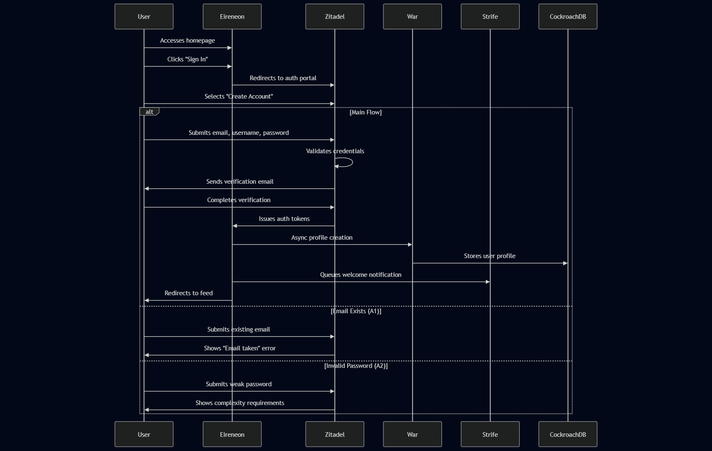

## Use Case: User Registration

**Description**:  
Allows new users to create an account by providing an email, username, and password through the Zitadel identity provider.

**Actor**:  
Unauthenticated user (no session cookie)

### Main Flow:

1. **Access Application**  
   - User navigates to the Eireneon homepage

2. **Initiate Authentication**  
   - User clicks the "Sign In" button in the UI
   - System redirects to Zitadel authentication portal

3. **Select Registration Option**  
   - User chooses "Create Account" option in Zitadel interface

4. **Submit Registration Data**  
   - User provides:
     - Valid email address
     - Unique username
     - Secure password (meeting complexity requirements)

5. **Account Verification**  
   - Zitadel sends verification email
   - User completes email verification

6. **Successful Registration**  
   - Zitadel creates user account
   - System issues authentication tokens
   - User is redirected back to Eireneon homepage
   - System displays welcome message and onboarding flow

### Alternative Flows:

**A1: Email Already Exists**  
- Zitadel interface detects existing email in identity database  
- System displays error: "This email is already registered"  

**A2: Invalid Password**  
- Zitadel validates password against complexity rules:  
  - Minimum 8 characters  
  - Requires uppercase, lowercase, number, and symbol
- System displays specific password requirements not met

### Post-Conditions:
- New user record created in Zitadel  
- User profile created in War service database  
- Initial user settings configured  
- Welcome notification queued in Strife service  
- Authentication session established  

### Error Handling:
- Network failures during registration retry automatically  
- Rate limiting prevents brute force attempts

### Security Considerations:
- All communications use HTTPS  
- Passwords hashed with Argon2
- Email verification required
- Session cookies are HttpOnly and Strict

### Zitadel UI Elements:
1. Registration Form Fields:
   - Email address (with validation)
   - Username (with availability check)
   - Password strength meter
   - Terms of service checkbox

2. Error States:
   - Field-specific validation messages
   - Password requirement checklist

3. Success State:
   - Redirect to user feed in Eireneon

This flow integrates with our OIDC provider (Zitadel) while maintaining application-specific business rules around usernames and initial profile setup. The War service asynchronously creates the user profile after successful identity verification.

### **Data Flow Diagram**  

